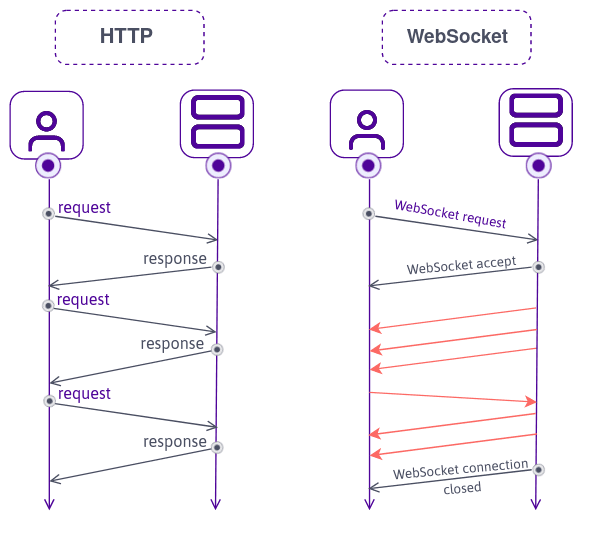

# Saindo do básico com Django Channels

---

## Avisos

- Foco em Django Channels
- Não vamos abordar Django e Websockets com profundidade

---

## Relembrando: o que é Django

- [Django](https://www.djangoproject.com/) é um framework web
- Desde 2005
- Tem uma estrutura muito característica
- Criado para prover o backend e integrar o front numa única aplicação

---

## Relembrando: o que são websockets

- Tecnologia que permite a comunicação bidirecional por canais full-duplex sobre um único soquete Transmission Control Protocol (TCP).

---

## O que é Django Channels?

- [**Django Channels**](https://channels.readthedocs.io/en/latest/) é um framework que utiliza como suporte o framework web Django para criar aplicações que utilizam outros protocolos além do HTTP;
- Provê suporte a:
  - **WebSockets**
  - **Eventos assíncronos**
  - **Protocolos de rede**
  - **Comunicação em tempo real**

---

## Como Funciona?

- ASGI
- Roteamento de WebSocket

---

## Assíncrono 
- ASGI (Asynchronous Server Gateway Interface) fornece camada assíncrona, que é a base para prover WebSockets e outras conexões em tempo real.

---

## Roteamento

- Channels permite criar rotas específicas para protocolos;
- Essas rotas são configuráveis, e é possível determinar consumidores para esses conteúdos;

---

## Consumidores

Manipula as mensagens recebidas e enviadas

---

## Canais e Brackend de canal

- Django Channels usa uma camada de canal para comunicação entre consumidores e outras partes da aplicação. Isso permite a comunicação em tempo real entre diferentes partes do sistema, como grupos de mensagens;

- Backend é uma ferramenta usada para persistência e distribuição de mensagens, como Redis. Provê eficiência e escalabilidade na transmissão de mensagens;

---

## Ferramentas mais comuns na implementação

**Bibliotecas Python**
- channels["daphne"]
- django
- channels-redis

**Backend**
- Redis

---

## Aplicações

Normalmente utilizado para prover comunicação em tempo real;
Casos de uso comuns:
- IoT;
- Chats de mensagens;
- GPS;

---
## Exibição de uma aplicação teste

# http://54.200.38.210

---

## Agradecimentos

Lucas Carvalho do grupy-sanca 
Sarah Tuyani - PyLadies DF